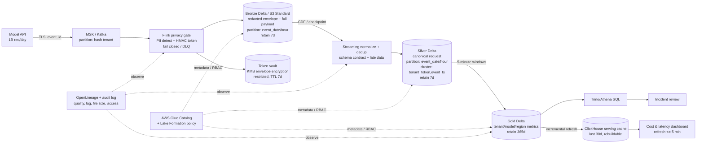

# Lakehouse cho LLM Observability ở quy mô 1 tỷ request/ngày

**Tác giả:** 2A202601089 — Đào Văn Đa  
**Vai trò:** Architect on-call  
**Quyết định:** Delta Lake trên S3, catalog bởi AWS Glue/Lake Formation, xử lý streaming fail-closed trước PII, Gold 5 phút và serving cache có thể tái tạo.

---

## 1. Problem statement

Hệ thống foundation-model nhận **1 tỷ request/ngày**, trung bình **5 KB/request**, tương đương **5 TB raw/ngày**. Tải trung bình là 11.574 request/s; tôi thiết kế cho peak 5×, tức khoảng 58.000 request/s và 290 MB/s. Dashboard phải cập nhật cost, latency và error rate theo tenant trong tối đa 5 phút. Prompt/response đầy đủ nhưng đã khử PII được giữ đúng 7 ngày để điều tra sự cố; sau đó chỉ aggregate được giữ 365 ngày. Không analyst nào được đọc PII thô, kể cả ở Bronze. Ngân sách storage cứng là **5.000 USD/tháng**.

Bài toán khó vì cùng lúc đòi hỏi ingestion thông lượng cao, privacy fail-closed, point lookup theo tenant, aggregation gần real-time và deletion có thể chứng minh. Partition theo tenant sẽ tạo hàng triệu partition; lưu JSON raw sẽ vượt chi phí scan; còn `VACUUM` thiếu kiểm soát có thể phá time travel. Thiết kế phải giữ nguồn sự thật có version, nhưng cache dashboard và token vault phải có lifecycle riêng. Mục tiêu vận hành là dashboard freshness p95 < 5 phút, pipeline recovery point ≤ 1 phút, file Parquet 256–512 MB và mọi lần detokenize đều audit được.

## 2. Kiến trúc đề xuất

### Luồng dữ liệu và invariants

- API phát `event_id` UUIDv7, `tenant_id`, event time và payload qua TLS. Kafka key là HMAC của tenant để giữ ordering mà không lộ ID.
- Privacy gate phát hiện email, phone, IP, payment identifiers và secrets; thay bằng token HMAC tenant-scoped trước lần ghi bền vững đầu tiên. Khi detector/KMS lỗi, event đi DLQ mã hóa, **không bypass**.
- Bronze giữ envelope và prompt/response đã token hóa để replay. Silver chuẩn hóa schema, dedup theo `event_id`, tính cost từ price-table có version và xử lý late event với watermark 24 giờ.
- Gold dùng window 5 phút theo tenant/model/region/status; ClickHouse chỉ là derived index. Xóa cache không mất dữ liệu và có thể rebuild từ Gold version đã pin.
- Glue là control plane cho location/schema/ownership; Lake Formation áp row filter tenant và column policy. OpenLineage ghi quan hệ Bronze → Silver → Gold và version input/output của từng job.

## 3. Các quyết định và lựa chọn bị loại

### D1 — Table format: chọn Delta Lake

Tôi chọn **Delta Lake** cho cả ba layer vì Structured Streaming, idempotent `MERGE`, Change Data Feed và `RESTORE` phù hợp pipeline request liên tục. CDF cũng là hợp đồng rõ ràng để cập nhật hoặc xóa serving cache.

- Tôi loại **Iceberg** cho MVP: hidden partitioning và REST catalog tốt hơn cho hệ sinh thái đa engine, nhưng pipeline này cần CDF/deletion propagation và đội vận hành đã dùng Delta streaming; đổi format làm tăng rủi ro trong tuần đầu.
- Tôi loại **Hudi**: incremental pull mạnh, nhưng thêm timeline/compaction semantics mà đội chưa vận hành; lợi ích không bù learning curve khi SLA freshness chỉ 5 phút.

Điều kiện xem xét lại: nếu >30% query chuyển sang Trino/Snowflake và Spark không còn là writer chính, thử nghiệm Iceberg trên Gold trước, không dual-write toàn bộ.

### D2 — Catalog và governance: chọn Glue + Lake Formation

Tôi chọn **AWS Glue Catalog** làm control plane và **Lake Formation** cho quyền truy cập vì storage nằm trên S3, policy được quản lý tập trung và không cần tự vận hành metastore HA.

- Tôi loại **Hive Metastore tự quản** vì database/backup/HA trở thành pager duty mới, trong khi thiếu policy cấp cột và audit tích hợp.
- Tôi loại **Unity Catalog** vì khóa governance vào Databricks; API team còn dùng Flink, Trino và ClickHouse.

Catalog chỉ trỏ đến table; không cấp quyền trực tiếp trên S3 cho analyst. Mỗi production job có IAM role riêng, còn break-glass detokenization cần phê duyệt hai người và tạo audit event bất biến.

### D3 — Partition và clustering: giờ sự kiện + tenant token

Tôi partition Bronze/Silver theo **`event_date/event_hour`** và cluster Silver theo **`tenant_token, event_ts`**. Với 1,67 TB/ngày sau nén mỗi layer, một giờ khoảng 70 GB; target 384 MB tạo khoảng 180 file/giờ — đủ lớn để scan song song nhưng không thành small-file storm.

- Tôi loại **partition theo tenant**: giả định 100.000 tenant sẽ tạo sparse partitions, metadata phình và hàng triệu object nhỏ.
- Tôi loại **chỉ partition theo ngày**: mỗi partition 1,67 TB khiến retry, retention và incident scan theo giờ đọc quá rộng.

Gold partition theo ngày, cluster theo tenant/model. Filter dashboard trên tenant dùng data skipping; không yêu cầu người dùng nhớ partition column.

### D4 — Compression và file size: ZSTD level 3, 256–512 MB

Tôi chọn **Parquet ZSTD level 3** và target file **256–512 MB**. Prompt text có độ lặp cao nên giả định nén 3:1; column pruning tránh đọc payload khi chỉ tính cost/latency.

- Tôi loại **Snappy** vì ưu tiên CPU thấp nhưng tỉ lệ nén kém hơn; thêm vài millisecond encode không đáng kể so với giảm storage và scan của 5 TB/ngày.
- Tôi loại **Gzip** vì encode/decode CPU cao, khó giữ peak 290 MB/s và không đem lại lợi ích đủ lớn so với ZSTD.

Writer flush theo cả size lẫn 2 phút. Compaction chạy mỗi giờ cho partition đã qua watermark; không compact partition đang được nhiều writer ghi.

### D5 — Privacy: token hóa deterministic trước Bronze

Tôi chọn **HMAC-SHA-256 tenant-scoped** cho identifiers cần join và token ngẫu nhiên cho secrets; key version nằm trong metadata, mapping nhạy cảm nằm ở token vault mã hóa bằng KMS và TTL 7 ngày.

- Tôi loại **masking lúc query** vì PII thô vẫn tồn tại trên S3 và có thể bị đọc qua credential sai hoặc backup.
- Tôi loại **hash không key** vì email/phone có entropy thấp, dễ dictionary attack và không hỗ trợ rotation có kiểm soát.

Detector lưu `redaction_policy_version`, loại PII và confidence. Mẫu false-negative được security review trong môi trường cô lập; analyst không được detokenize mặc định.

### D6 — Lifecycle: xóa table-aware, không dùng S3 lifecycle mù

Tôi giữ Bronze/Silver trên **S3 Standard đúng 7 ngày**, Gold 30 ngày Standard rồi 335 ngày Standard-IA. Job hằng giờ xóa partition quá hạn bằng Delta transaction, đợi safety window 24 giờ rồi `VACUUM`; orphan scanner so sánh object listing với transaction log.

- Tôi loại **S3 lifecycle xóa trực tiếp file data ngày thứ 8** vì nó không hiểu Delta log và có thể làm hỏng snapshot đang hợp lệ.
- Tôi loại **Glacier Instant Retrieval cho payload 7 ngày** vì minimum storage 90 ngày trái lifecycle 7 ngày; phí early deletion triệt tiêu tiết kiệm.

Time travel Bronze/Silver giới hạn 24 giờ, không phải 7 ngày. Gold giữ 30 ngày history để rollback dashboard; aggregate cũ vẫn tồn tại 365 ngày nhưng snapshot cũ được expire.

### D7 — Streaming engine: Flink cho privacy gate, Spark cho lakehouse jobs

Tôi chọn **Flink** cho redaction stateful/low-latency và **Spark Structured Streaming** cho Delta normalize, MERGE, aggregate và maintenance.

- Tôi loại **Lambda per event** vì 58.000 invocation/s peak, payload parsing/model detector và retry fan-out gây chi phí cùng backpressure khó kiểm soát.
- Tôi loại **chỉ Spark micro-batch cho privacy gate** vì failure trước checkpoint có thể kéo dài và logic stateful per-record khó quan sát hơn; Spark vẫn phù hợp downstream SLA 5 phút.

Kafka retention 24 giờ tạo buffer khi S3/Spark lỗi. Cả hai consumer commit offset chỉ sau durable write và dựa vào `event_id` để dedup khi replay.

### D8 — Query serving: Gold là nguồn thật, ClickHouse là cache

Tôi chọn **Trino/Athena trên Gold** cho điều tra và **ClickHouse** chứa 30 ngày aggregate cho dashboard. Refresh đọc CDF mỗi phút; mỗi batch ghi kèm `gold_table_version`.

- Tôi loại **dashboard scan Silver** vì payload rộng và 7 ngày Silver khoảng 10 TB; một filter thiếu tenant sẽ đốt chi phí và không đạt latency.
- Tôi loại **warehouse copy làm nguồn sự thật thứ hai** vì deletion/version drift khó audit. ClickHouse được phép mất và rebuild từ Gold.

## 4. Failure modes và runbook lúc 03:00

| Failure mode | Detection cụ thể | Containment và rollback |
|---|---|---|
| **PII detector hoặc KMS lỗi** | `redaction_success_rate < 100%`, DLQ tăng, canary PII xuất hiện ở output | Fail closed; dừng Bronze writer, giữ event trong Kafka/DLQ mã hóa. Roll back image detector, replay theo offset; security kiểm tra canary trước resume. Không có chế độ “ghi trước, redact sau”. |
| **Schema evolution phá parser** | Contract registry báo field/type lạ; Silver bad-record rate >0,1%; checkpoint không tiến 2 phút | Bronze vẫn append envelope; quarantine schema mới. Deploy parser tương thích hoặc pin producer version, rồi replay Bronze. Không bật auto-merge cho type change; additive nullable field mới được phép. |
| **Bad MERGE làm sai Silver/Gold** | Row-count delta, duplicate rate hoặc cost total lệch >1% so với Bronze control total | Dừng Gold refresh; pin version lỗi, `RESTORE` Silver/Gold về version trước, sửa job và replay CDF. Giữ history 24 giờ nên rollback không phụ thuộc backup. |
| **Small-file explosion** | p50 file <128 MB trong 3 interval; file count/hour >2× baseline; planning time >10 s | Giảm trigger frequency, khóa compaction trên closed hour, OPTIMIZE + cluster. Nếu compaction lỗi, đọc version trước; không `VACUUM` cho tới khi row-count checksum khớp. |
| **Kafka replay tạo duplicate** | Unique `event_id`/total <99,999%; offset lùi nhưng input volume tăng; dashboard cost nhảy | Idempotent Bronze txn `(app_id,batch_id)` và Silver MERGE theo `event_id`. Rewind checkpoint về offset tốt, replay; Gold recompute window bị ảnh hưởng. |
| **Gold → ClickHouse bị stale** | `now - max(window_end) > 5 min` hoặc `gold_table_version` lag >2 | Dashboard gắn banner stale và fallback Trino cho tenant ưu tiên. Xóa partition cache lỗi, rebuild từ Gold version pin; không sửa trực tiếp số liệu cache. |
| **Retention xóa quá sớm** | Daily manifest audit thấy min event date > policy; incident test không đọc đủ 7 ngày | Dừng vacuum và lifecycle. Khôi phục object từ versioned backup nếu file đã physical-delete; RESTORE table khi còn tombstone. Mọi retention change cần dry-run count/bytes và phê duyệt. |

Hai canary bắt buộc được chạy mỗi release: (1) file chưa từng commit phải được orphan scanner phát hiện — không giả định `VACUUM` nhìn thấy; (2) restore version trước phải khôi phục đúng checksum. Đây là bài học trực tiếp từ NB3 và NB6.

## 5. Ước lượng chi phí back-of-envelope

### Giả định

- 5 TB raw/ngày (decimal), ZSTD trung bình **3:1**.
- Bronze 1,67 TB/ngày và Silver 1,40 TB/ngày vì bỏ field không cần thiết; cả hai giữ 7 ngày.
- Headroom transaction log, tombstone, compaction và schema: 20%.
- Gold: 20.000 group hoạt động mỗi window × 288 window/ngày × 200 byte nén ≈ 1,15 GB/ngày, làm tròn **0,42 TB/năm**.
- Đơn giá minh họa us-east-1: S3 Standard **0,023 USD/GB-tháng**, Standard-IA **0,0125 USD/GB-tháng**; phải thay bằng bảng giá region khi phê duyệt.

### Storage

| Thành phần | Phép tính | USD/tháng |
|---|---:|---:|
| Bronze hot | 1,67 TB/ngày × 7 × 1.024 GB/TB × $0,023 | $275 |
| Silver hot | 1,40 × 7 × 1.024 × $0,023 | $231 |
| 20% compaction/history headroom | ($275 + $231) × 20% | $101 |
| Gold 30 ngày Standard | 0,035 TB × 1.024 × $0,023 | $1 |
| Gold 335 ngày Standard-IA | 0,385 TB × 1.024 × $0,0125 | $5 |
| Catalog/log/checkpoint reserve | 0,5 TB × 1.024 × $0,023 | $12 |
| Request + inventory reserve | budget guard | $50 |
| **Tổng storage** | | **≈ $675/tháng** |

Ngay cả khi compression chỉ 2:1 và storage gấp 1,5 lần, chi phí khoảng $1.013/tháng — vẫn dưới cap $5.000 với margin gần 80%. Alert mở ở $3.500; $4.000 chặn tăng retention và yêu cầu FinOps review. Không dùng margin để giữ PII lâu hơn policy.

### Compute và serving

EMR Serverless công bố ví dụ giá Linux/x86 **$0,052624/vCPU-hour** và **$0,0057785/GB-hour**; billing theo tài nguyên worker thực dùng. Ước lượng:

- Streaming average 64 vCPU + 256 GB: 64 × 730 × $0,052624 + 256 × 730 × $0,0057785 = **$3.538/tháng**.
- Compaction/Gold: 512 vCPU + 2 TB RAM × 2 giờ/ngày × 30 = **$2.326/tháng**.
- Kafka, ClickHouse, Trino control plane và monitoring reserve: **$3.000/tháng**.
- **Tổng compute/serving ≈ $8.864/tháng; tổng platform gồm storage ≈ $9.539/tháng.** Storage cap đạt ở $675; compute là cost driver cần tối ưu bằng autoscaling/Graviton/commit plan, không bằng cách phá retention.

Đơn giá là estimate, không phải báo giá. S3 còn tính request/retrieval và Standard-IA có minimum duration; FinOps dashboard phải dùng Cost and Usage Report theo tag `layer`, `table`, `tenant_class`.

## 6. MVP một tuần

MVP không ingest 1 tỷ event. Nó chứng minh ba rủi ro khó nhất — privacy trước Bronze, idempotent replay và dashboard ≤5 phút — trên tải 1% (10 triệu event/ngày).

| Ngày | Slice giao được | Acceptance gate |
|---|---|---|
| 1 | Contract v1, Kafka topic, synthetic generator có PII canary và duplicate | 100.000 event/s burst trong 10 phút; có `event_id`, event time, tenant key |
| 2 | Flink privacy gate + KMS dev key + DLQ | 0 PII canary trong Bronze; tắt KMS làm pipeline fail closed, không mất event |
| 3 | Bronze/Silver Delta, dedup, watermark 24 giờ, schema quarantine | Replay cùng offset hai lần không tăng row count; late event cập nhật đúng window |
| 4 | Gold 5 phút + ClickHouse incremental refresh | Dashboard freshness p95 <5 phút; tổng cost Gold lệch <0,1% control total |
| 5 | OPTIMIZE, retention dry-run, orphan scanner, RESTORE drill | p50 file 256–512 MB; planted orphan được tìm; restore checksum chính xác |
| 6 | Load/chaos test 1%, cost extrapolation, lineage + access audit | Backlog về 0 sau outage 30 phút trong <60 phút; lineage có version input/output |
| 7 | Runbook game day và go/no-go review | On-call xử lý ba failure scenario không truy cập PII thô; ký risk register |

**Không nằm trong MVP:** multi-region, ML detector tùy biến, chargeback chính thức, 365-day backfill và UI detokenization. Chỉ scale lên 10% sau khi privacy canary, replay, compaction và cost/event đều đạt gate trong ba ngày liên tiếp.

## 7. SLO, ownership và quyết định còn mở

| SLO / guardrail | Target | Owner |
|---|---:|---|
| Dashboard freshness p95 | <5 phút | Analytics Platform |
| Bronze durable lag p99 | <60 giây | Streaming Platform |
| PII canary leak | 0 | Security + Privacy |
| Duplicate sau Silver | <0,001% | Data Platform |
| File p50 / p95 | 256 MB / <768 MB | Lakehouse Ops |
| Storage cost | alert $3.500, hard review $4.000 | FinOps |
| Incident replay | 7 ngày, tenant-scoped | On-call |

Quyết định còn mở trước production: benchmark ZSTD ratio trên payload thật; xác nhận tenant cardinality và active-group density; kiểm tra residency region; chọn threshold false-positive cho detector; và đo ClickHouse sizing. Những con số này thay đổi capacity, nhưng không thay đổi invariants: PII không được ghi thô, Gold/cache phải tái tạo được, retention phải table-aware và mọi training/incident extract phải pin table version.

## PoC đi kèm

[`poc/tokenization_demo.ipynb`](poc/tokenization_demo.ipynb) chứng minh phần rủi ro nhất của privacy gate bằng dữ liệu tổng hợp: token deterministic trong cùng tenant, không link được giữa hai tenant, token thay đổi có version khi rotate key, và thiếu key làm pipeline fail closed. Bản `.py` tương đương chạy hoàn toàn bằng standard library và có bốn assertion gate.

## Nguồn giá tham khảo

- [Amazon S3 Pricing](https://aws.amazon.com/s3/pricing/) — storage class, request, retrieval và minimum-duration rules.
- [Amazon EMR Pricing](https://aws.amazon.com/emr/pricing/) — cách tính EMR Serverless theo vCPU-hour và memory GB-hour.
- [AWS S3 storage-class guide](https://docs.aws.amazon.com/AmazonS3/latest/userguide/storage-class-intro.html) — Glacier Instant Retrieval có minimum 90 ngày và minimum object size 128 KB.
